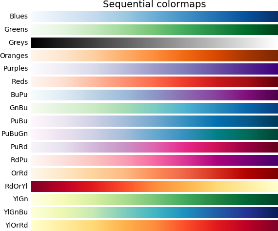
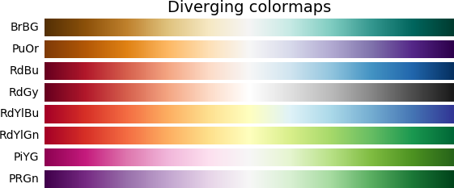
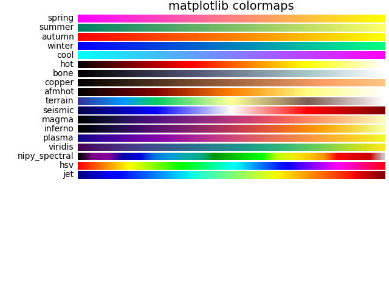
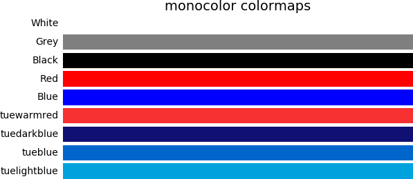
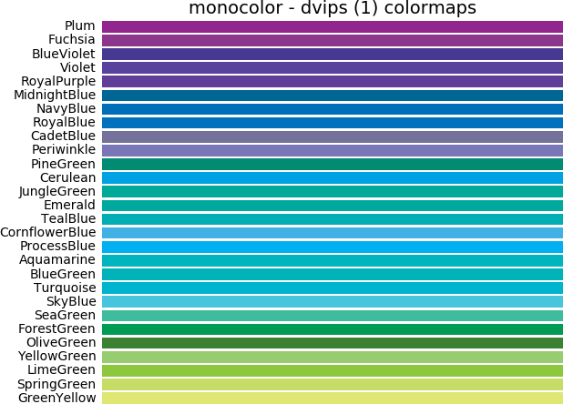
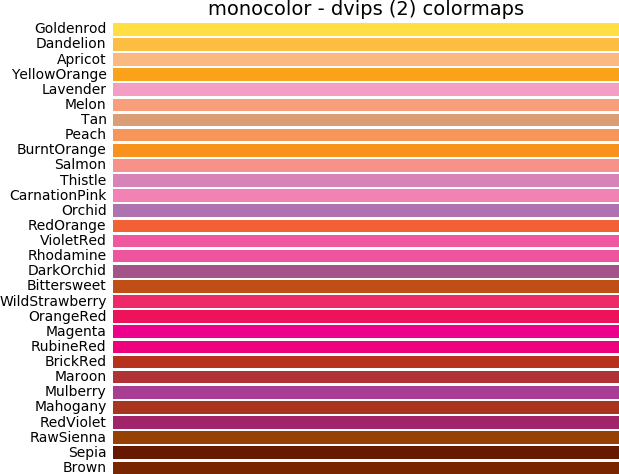
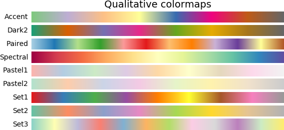

[](https://github.com/tdegeus/cppcolormap/actions)
[](https://tdegeus.github.io/cppcolormap)
[](https://readthedocs.org/projects/cppcolormap/badge/?version=latest)
[](https://anaconda.org/conda-forge/cppcolormap)
[](https://anaconda.org/conda-forge/python-cppcolormap)

**Documentation: [cppcolormap.readthedocs.org](https://cppcolormap.readthedocs.org)**

**Doxygen documentation: [tdegeus.github.io/cppcolormap](https://tdegeus.github.io/cppcolormap)**

# cppcolormap

C++ and Python library specifying colormaps. 

<p align="center"> 
    
</p>

<p align="center"> 
    
</p>

<p align="center"> 
    
</p>

<p align="center"> 
    
</p>

<p align="center"> 
    
</p>

<p align="center"> 
    
</p>

<p align="center"> 
    
</p>

<p align="center"> 
    
</p>

# Contents

<!-- MarkdownTOC levels="1,2" -->

- [Disclaimer](#disclaimer)
- [Usage from C++](#usage-from-c)
    - [Getting cppcolormap](#getting-cppcolormap)
    - [Usage](#usage)
    - [Find match](#find-match)
    - [Compiling](#compiling)
- [Usage from Python](#usage-from-python)
    - [Getting cppcolormap](#getting-cppcolormap-1)
    - [Usage](#usage-1)
    - [Find match](#find-match-1)
    - [Example](#example)
- [Available colormaps](#available-colormaps)
    - [ColorBrewer](#colorbrewer)
    - [matplotlib](#matplotlib)
    - [monocolor](#monocolor)
- [Available colorcycles](#available-colorcycles)
    - [Xterm](#xterm)
    - [Eindhoven University of Technology](#eindhoven-university-of-technology)

<!-- /MarkdownTOC -->

# Disclaimer

This library is free to use under the [GPLv3 license](https://github.com/tdegeus/cppcolormap/blob/master/LICENSE). Any additions are very much appreciated, in terms of suggested functionality, code, documentation, testimonials, word-of-mouth advertisement, etc. Bug reports or feature requests can be filed on [GitHub](https://github.com/tdegeus/cppcolormap). As always, the code comes with no guarantee. None of the developers can be held responsible for possible mistakes.

Download: [.zip file](https://github.com/tdegeus/cppcolormap/zipball/master) | [.tar.gz file](https://github.com/tdegeus/cppcolormap/tarball/master).

(c - [GPLv3](https://github.com/tdegeus/cppcolormap/blob/master/LICENSE)) T.W.J. de Geus (Tom) | tom@geus.me | www.geus.me | [github.com/tdegeus/cppcolormap](https://github.com/tdegeus/cppcolormap)

**Contributors**

*   [Wolf Vollprecht](https://github.com/wolfv)

# Usage from C++

## Getting cppcolormap

### Using conda

```
conda install -c conda-forge cppcolormap
```

### From source

```bash
# Download cppcolormap
git checkout https://github.com/tdegeus/cppcolormap.git
cd cppcolormap

# For CMake or pkg-config use
cmake .
make install
```

## Usage

The principle interface is with these two functions:

```cpp
#include <cppcolormap.h>

int main()
{
    std::cout << cppcolormap::colormap("Reds") << std::endl;
    std::cout << cppcolormap::colorcycle("tue") << std::endl;

    return 0;
}
```

Lists of [colormaps](#available-colormaps) and [color-cycles](#available-color-cycles) can be found below.

The colormaps are stored as a matrix whereby each row contains the (R,G,B) colors. Each color value has a range `[0..1]`. The number of colors varies from map to map, but can be interpolated by specifying the number of colors you want:

```cpp
#include <cppcolormap.h>

int main()
{
    std::cout << cppcolormap::colormap("Reds", 256) << std::endl;

    return 0;
}
```

Note that the colorcycles are not interpolatable. Consequently the functions do have a size option. Note also that the colormaps and colorcycles can also be called directly, e.g.

```cpp
#include <cppcolormap.h>

int main()
{
    std::cout << cppcolormap::Reds() << std::endl;
    std::cout << cppcolormap::Reds(256) << std::endl;
    std::cout << cppcolormap::tue() << std::endl;

    return 0;
}
```

## Find match

To find the closest match of each color of a colormap in another colormap you can use:

```cpp
xt::xtensor<size_t,1> idx = cppcolormap::match(cmap1, cmap2);
xt::xtensor<size_t,1> idx = cppcolormap::match(cmap1, cmap2, cppcolormap::metric::euclidean);
```

The following metrics can be used:

*   euclidean (default)
*   fast_perceptual
*   perceptual

## Compiling

### Using CMake

Using *cppcolormap* the `CMakeLists.txt` can be as follows

```cmake
cmake_minimum_required(VERSION 3.1)
project(example)
find_package(cppcolormap REQUIRED)
add_executable(example example.cpp)
target_link_libraries(example PRIVATE cppcolormap)
```

Note that the target *cppcolormap* includes the target *xtensor* (itself automatically enforcing the minimal C++14 standard), which is automatically searched using `find_package(cppcolormap)`.

Compilation can then proceed using

*   Unix:

    ```
    cmake .
    make
    ```

*   Windows:

    ```none
    cmake -G"NMake Makefiles" .
    nmake
    ```

[Download example "CMakeLists.txt"](./example/CMakeLists.txt)

### Using pkg-config

Presuming that the compiler is `c++`, compile using (Unix):

```
c++ `pkg-config --cflags cppcolormap` `pkg-config --cflags xtensor` -std=c++14 ...
```

### By hand

Presuming that the compiler is `c++`, compile using (Unix):

```
c++ -I/path/to/cppcolormap/include -I/path/to/xtensor/include  -std=c++14 ...
```

# Usage from Python

## Getting cppcolormap

### Using conda

```
conda install -c conda-forge python-cppcolormap
```

### From source

```bash
# Download cppcolormap
git checkout https://github.com/tdegeus/cppcolormap.git
cd cppcolormap

# Compile and install 
python -m pip install .
```

Note that you have to install the dependencies *pybind11*, *xtensor*, and *pyxtensor* first.

## Usage

There are two principle functions, each returns a 2-d NumPy array:

```python
import cppcolormap as cm

# number of colors in the colormap (optional, may be omitted)
N = 256

# specify the colormap as string
cols = cm.colormap("Reds", N)
cols = cm.colorcycle("tue")

# or call the functions directly
cols = cm.Reds(N)
cols = cm.tue()
```

(see lists of [colormaps](#available-colormaps) and [color-cycles](#available-color-cycles) below).

## Find match

To find the closest match of each color of a colormap in another colormap you can use:

```cpp
idx = cm.match(cmap1, cmap2)
idx = cm.match(cmap1, cmap2, cm.metric.perceptual)
```

(See metrics [above](#find-match).)

## Example

```python
import matplotlib
import matplotlib.pyplot as plt
import numpy as np
import cppcolormap as cm

x, y = np.meshgrid(
    np.linspace(0, 1, 100), 
    np.linspace(0, 1, 100))

d = np.sqrt(x ** 2.0 + y ** 2.0)

C = cm.Reds(256)
C = np.c_[C, np.ones(C.shape[0])]

cmap = matplotlib.colors.LinearSegmentedColormap.from_list('my_colormap', C)

fig, ax = plt.subplots()
cax = ax.imshow(d, cmap=cmap)
plt.show()
```

# Available colormaps

## ColorBrewer

| Name     | Inverse colormap |
|----------|------------------|
| Accent   | Accent_r         |
| Dark2    | Dark2_r          |
| Paired   | Paired_r         |
| Spectral | Spectral_r       |
| Pastel1  | Pastel1_r        |
| Pastel2  | Pastel2_r        |
| Set1     | Set1_r           |
| Set2     | Set2_r           |
| Set3     | Set3_r           |
| Blues    | Blues_r          |
| Greens   | Greens_r         |
| Greys    | Greys_r          |
| Oranges  | Oranges_r        |
| Purples  | Purples_r        |
| Reds     | Reds_r           |
| BuPu     | BuPu_r           |
| GnBu     | GnBu_r           |
| PuBu     | PuBu_r           |
| PuBuGn   | PuBuGn_r         |
| PuRd     | PuRd_r           |
| RdPu     | RdPu_r           |
| OrRd     | OrRd_r           |
| RdOrYl   | RdOrYl_r         |
| YlGn     | YlGn_r           |
| YlGnBu   | YlGnBu_r         |
| YlOrRd   | YlOrRd_r         |
| BrBG     | BrBG_r           |
| PuOr     | PuOr_r           |
| RdBu     | RdBu_r           |
| RdGy     | RdGy_r           |
| RdYlBu   | RdYlBu_r         |
| RdYlGn   | RdYlGn_r         |
| PiYG     | PiYG_r           |
| PRGn     | PRGn_r           |

>   Copyright (c) 2002 Cynthia Brewer, Mark Harrower, and The Pennsylvania State University.
>   
>   Licensed under the Apache License, Version 2.0
>   
>   [colorbrewer2.org](http://colorbrewer2.org)

## matplotlib

| Name          | Inverse colormap |
|---------------|------------------|
| spring        | spring_r         |       
| summer        | summer_r         |       
| autumn        | autumn_r         |       
| winter        | winter_r         |       
| bone          | bone_r           |     
| cool          | cool_r           |     
| hot           | hot_r            |    
| copper        | copper_r         |       
| hsv           | hsv_r            |    
| nipy_spectral | nipy_spectral_r  |              
| terrain       | terrain_r        |        
| seismic       | seismic_r        |        
| afmhot        | afmhot_r         |       
| magma         | magma_r          |      
| inferno       | inferno_r        |        
| plasma        | plasma_r         |       
| viridis       | viridis_r        |        
| jet           | jet_r            |    

>   Copyright (c)  New matplotlib colormaps by Nathaniel J. Smith, Stefan van der Walt, and 
>   in the case of viridis) Eric Firing.
>   
>   Licensed under the CC0 license / public domain dedication.
>   
>   [GitHub](https://github.com/BIDS/colormap)

## monocolor

| Name           | Inverse colormap | Source |
|----------------|------------------|--------|
| White          | -                |        |
| Grey           | -                |        |
| Black          | -                |        |
| Red            | -                |        |
| Blue           | -                |        |
| tuedarkblue    | -                | [1]    |
| tueblue        | -                | [1]    |
| tuelightblue   | -                | [1]    |
| tuewarmred     | -                | [1]    |
| Apricot        | -                | [2]    |  
| Aquamarine     | -                | [2]    |  
| Bittersweet    | -                | [2]    |  
| Black          | -                | [2]    |  
| Blue           | -                | [2]    |  
| BlueGreen      | -                | [2]    |  
| BlueViolet     | -                | [2]    |  
| BrickRed       | -                | [2]    |  
| Brown          | -                | [2]    |  
| BurntOrange    | -                | [2]    |  
| CadetBlue      | -                | [2]    |  
| CarnationPink  | -                | [2]    |  
| Cerulean       | -                | [2]    |  
| CornflowerBlue | -                | [2]    |  
| Cyan           | -                | [2]    |  
| Dandelion      | -                | [2]    |  
| DarkOrchid     | -                | [2]    |  
| Emerald        | -                | [2]    |  
| ForestGreen    | -                | [2]    |  
| Fuchsia        | -                | [2]    |  
| Goldenrod      | -                | [2]    |  
| Gray           | -                | [2]    |  
| Green          | -                | [2]    |  
| GreenYellow    | -                | [2]    |  
| JungleGreen    | -                | [2]    |  
| Lavender       | -                | [2]    |  
| LimeGreen      | -                | [2]    |  
| Magenta        | -                | [2]    |  
| Mahogany       | -                | [2]    |  
| Maroon         | -                | [2]    |  
| Melon          | -                | [2]    |  
| MidnightBlue   | -                | [2]    |  
| Mulberry       | -                | [2]    |  
| NavyBlue       | -                | [2]    |  
| OliveGreen     | -                | [2]    |  
| Orange         | -                | [2]    |  
| OrangeRed      | -                | [2]    |  
| Orchid         | -                | [2]    |  
| Peach          | -                | [2]    |  
| Periwinkle     | -                | [2]    |  
| PineGreen      | -                | [2]    |  
| Plum           | -                | [2]    |  
| ProcessBlue    | -                | [2]    |  
| Purple         | -                | [2]    |  
| RawSienna      | -                | [2]    |  
| Red            | -                | [2]    |  
| RedOrange      | -                | [2]    |  
| RedViolet      | -                | [2]    |  
| Rhodamine      | -                | [2]    |  
| RoyalBlue      | -                | [2]    |  
| RoyalPurple    | -                | [2]    |  
| RubineRed      | -                | [2]    |  
| Salmon         | -                | [2]    |  
| SeaGreen       | -                | [2]    |  
| Sepia          | -                | [2]    |  
| SkyBlue        | -                | [2]    |  
| SpringGreen    | -                | [2]    |  
| Tan            | -                | [2]    |  
| TealBlue       | -                | [2]    |  
| Thistle        | -                | [2]    |  
| Turquoise      | -                | [2]    |  
| Violet         | -                | [2]    |  
| VioletRed      | -                | [2]    |  
| White          | -                | [2]    |  
| WildStrawberry | -                | [2]    |  
| Yellow         | -                | [2]    |  
| YellowGreen    | -                | [2]    |  
| YellowOrange   | -                | [2]    |  

1.  [Eindhoven University of Technology](http://www.tue.nl)
2.  [LaTeX xcolor (dvipsnames)](https://en.wikibooks.org/wiki/LaTeX/Colors)

# Available colorcycles

## Xterm

| Name  | Inverse colormap |
|-------|------------------|
| xterm | xterm_r          |

>   See [this site](https://jonasjacek.github.io/colors/)

## Eindhoven University of Technology

| Name | Inverse colormap |
|------|------------------|
| tue  | tue_r            |


>   Based on the corporate color scheme of the 
>   [Eindhoven University of Technology](http://www.tue.nl).
